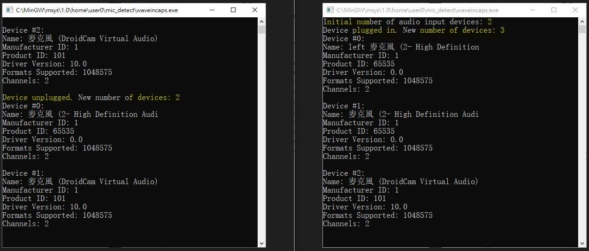

# Window_microphone_detect
PC microphone plugin detection  
source code & exe.  
commandline to compile the code, see soruce code  
uses make to compile the code, rename Makefile_c or Makefile_cpp to be Makefile, the make  


### [waveincaps.c](waveincaps.c)
testing done.  
Device# will has change and trigger, index is always 0, record the list and name will be able to identify which input is plugging exactly, No implementation yet.
  


### [microphone_detect.cpp](microphone_detect.cpp)
bug  
waveInCaps.szPname, print bug, no fix  


### [mic_name.cpp](mic_name.cpp)
bug  
waveInCaps.szPname, print bug, no fix.  
```
```
